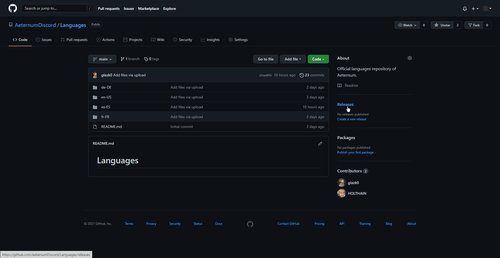
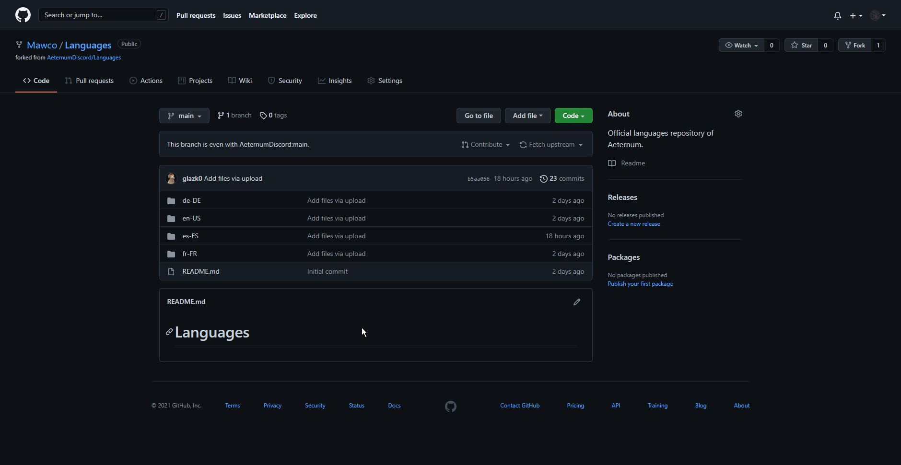
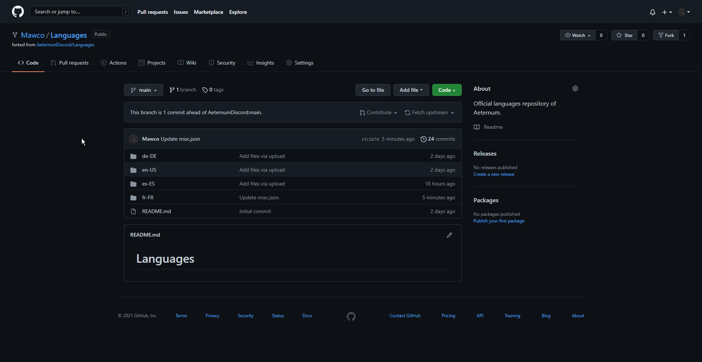

# Languages
Language files for the [Aeternum Discord Bot](https://discord.gg/J3PSURQ8xZ)

## How to contribute ?

1. First, you'll need a **GitHub** account. Just go to the [sign up page](https://github.com/signup). Once it's done, you can fork the repository.
   
> 

2. Now, you can edit the files and save it when you're done, it won't change anything on the bot.

> 

3. Now, we must **merge** the changes to the main repository, we're gonna create what's called a pull request.

> 

Once the pull request is created, you don't have to do anything else.

# Credits

Thanks to 🇹🇷 [Excoupe](https://github.com/excoupe), 🇪🇸 [HOLTHAIN](https://github.com/HOLTHAIN), 🇮🇹 [FraWolf](https://github.com//FraWolf), 🇫🇷 [Unyxos](https://github.com/Unyxos), 🇩🇪 [Tango-007](https://github.com/Tango-007), 🇵🇹 [GinKun](https://github.com/pombimsjb), 🇵🇱 [szydab1](https://github.com/UP814818) for their contribution.
